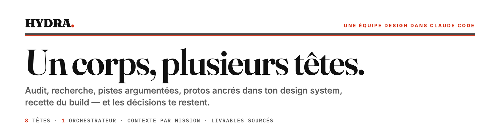
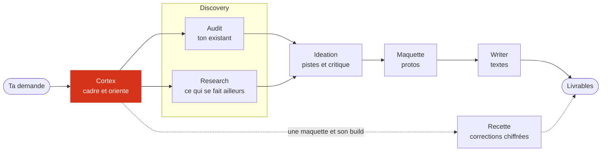
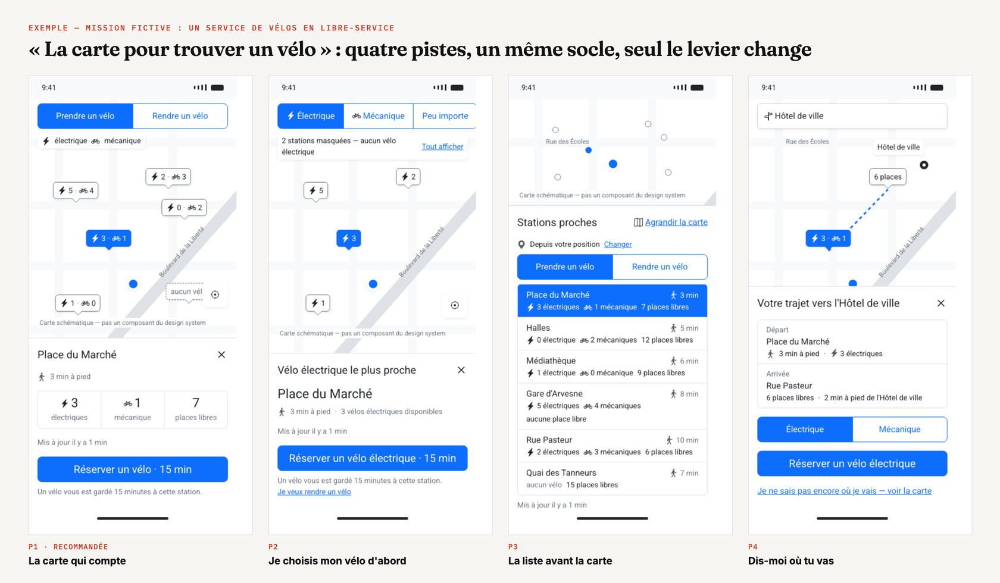

<picture>
  <source media="(prefers-color-scheme: dark)" srcset="docs/assets/banniere-sombre.png">
  
</picture>

<p align="center">
  <a href="LICENSE"></a>
  
  
  
</p>

<p align="center">
  <a href="https://mcqx7.github.io/hydra-agent/"><b>La présentation complète</b></a> ·
  <a href="#démarrer">Démarrer</a> ·
  <a href="#demander-une-seule-chose">Demander une seule chose</a> ·
  <a href="#les-têtes">Les têtes</a>
</p>

---

**Tu déposes un sujet — un écran existant, des documents, un problème — et Hydra le
mène** : audit de l'existant, recherche, pistes argumentées et critiquées, protos
composés avec ton design system, textes vérifiés, recette graphique du build. Il fait
le travail d'une petite équipe autour du designer, et lui laisse les décisions.

Il ne flatte pas : une idée faible se dit avec son pourquoi, une affirmation cite sa
source, une absence de données se dit au lieu de se combler.

## En un coup d'œil



La phase de discovery réunit deux têtes : l'audit, qui regarde ton existant, et
research, qui regarde ailleurs. Hydra n'appelle que les têtes dont ta demande a besoin.

## Ce qu'un sujet produit



<sub>Exemple tiré d'une mission fictive : quatre pistes de nature différente, composées sur le même socle d'écran avec les composants du design system — seul le levier change, pour comparer sur pièce. La carte, absente du design system, est schématisée et étiquetée comme telle.</sub>

| Livrable | Ce qu'il contient |
|---|---|
| `01-fiche` | Le cadrage : le problème, l'indicateur qui tranchera et son seuil, qui est touché, le périmètre, les rendus (mobile, desktop), ce qui est déjà décidé. |
| `02-rapport` | Les constats sur l'existant, les hypothèses, les références, les pistes — chacune critiquée —, la convergence et la recommandation. Chaque affirmation renvoie à sa source. |
| `03-brief` | Pour chaque piste, ce que l'écran doit montrer, avec quoi le composer, et un texte de composition que n'importe qui peut reprendre dans son outil. |
| `explorations/` | La galerie : un proto HTML manipulable par piste, dans les rendus de ta plateforme. |
| Recette | Pour le développeur : un tableau par zone de l'écran, desktop et mobile, valeur attendue, valeur mesurée sur le build, sévérité, capture annotée. |

Deux façons de dérouler : **d'un trait** — Hydra va jusqu'au bout et consigne ses
arbitrages en hypothèses — ou **par étapes** — il s'arrête aux moments clés pour que
tu tranches.

## Démarrer

**Il te faut** :
- **Claude Code**, idéalement avec **Opus** : Hydra est conçu pour Opus en effort
  élevé (la tête recette en effort moyen) — c'est un parti pris, tiré de tests
  comparés. Il fonctionne aussi avec Sonnet ou un effort plus bas, si ton offre ne
  permet pas mieux : ses livrables sont alors moins bons.
- **Node.js 22** ou plus récent, et **Google Chrome** (ou Chromium) : les outils
  sont des scripts Node, sans dépendance à installer, qui capturent les protos et
  mesurent le build.
- **Les outils de ta mission**, si tu les as, branchés comme connecteurs MCP de Claude
  Code : un outil de design pour lire les maquettes, un outil de benchmark pour les
  écrans de produits réels. Aucun n'est obligatoire ; l'analytics se lit aujourd'hui
  par les exports que tu déposes dans un sujet.

**Puis** :
1. Récupère ce dossier, et ouvre une session Claude Code à sa racine.
2. Écris **« je viens de lancer Hydra »**. L'accueil t'explique le fonctionnement,
   pose les modèles vides du contexte et les pré-remplit avec toi : ta mission, tes
   outils, ton design system, tes utilisateurs.
3. Dépose ton premier sujet : crée `topics/<nom>/inputs/`, mets-y tes documents, et
   écris par exemple « Audit de [sujet] : [lien de la maquette ou URL de prod].
   Déroule. »

Le contexte n'a pas à être complet le premier jour : à chaque cadrage, Hydra demande
ce qui manque, puis te propose de l'ajouter, et l'écrit après ton accord.

<details>
<summary><b>Écarter tes autres fichiers d'instructions</b> — à faire si tu as un <code>CLAUDE.md</code> personnel ou dans un dossier au-dessus</summary>

Claude Code charge dans chaque session ton `CLAUDE.md` personnel (`~/.claude/CLAUDE.md`)
et ceux des dossiers au-dessus de celui-ci : ils se mêleraient à la méthode d'Hydra.
Pour les écarter, crée `.claude/settings.local.json` (jamais versionné) :

```json
{
  "claudeMdExcludes": [
    "/chemin/absolu/vers/le/dossier/parent/CLAUDE.md"
  ]
}
```

Un chemin par fichier à écarter ; un motif comme `**/mon-dossier/CLAUDE.md` marche
aussi. Le `CLAUDE.md` d'Hydra, lui, doit rester chargé. L'accueil le vérifie avec toi,
et un `CLAUDE.md` ajouté plus tard, non écarté, est signalé à la session suivante.
</details>

## Demander une seule chose

Tout n'est pas un sujet complet. Hydra choisit les têtes d'après ta demande — inutile
de les nommer — et s'arrête au livrable de la demande : il te propose la suite, il ne
l'enchaîne pas.

| Tu demandes | Ce que tu reçois |
|---|---|
| « Audite cette page », « trouve les points de friction de ce parcours » | la fiche et le rapport : constats priorisés, hypothèses, références, actions |
| « Quels sont les meilleurs patterns pour… », « les bonnes pratiques d'usage de… » | un livrable de recherche court, avec les écrans en images et les liens vers les sources |
| « Que disent les études sur… », sur un sujet précis | un livrable de recherche : ce que les études, articles et guides établissent, et les enseignements pour ta problématique |
| Un benchmark ou un état de l'art approfondi | la fiche et un livrable de recherche complet, produits visités en direct compris |
| « Challenge cette idée », « aide-moi à trancher » | la fiche et le rapport : les pistes, leur critique, une recommandation |
| « Quel libellé pour… », « relis ces textes » | des variantes argumentées, dans la conversation |
| « Est-ce conforme à la maquette ? » | la recette : la liste de corrections pour le développeur |

## Les têtes

| Tête | Ce qu'elle fait |
|---|---|
| `hydra-accueil` | À la première session : explique Hydra et pré-remplit le contexte avec toi. |
| `hydra-cortex` | Orchestre : cadrage, déroulé, pauses, clôture. N'écrit aucun livrable. |
| `hydra-audit` | Évalue ton existant — une page en ligne ou une maquette — et le croise avec tes documents : constats, hypothèses. |
| `hydra-research` | Ce qui se fait et ce qui est prouvé ailleurs : écrans de produits réels, produits visités, design systems publics, études. Références sourcées et datées. |
| `hydra-ideation` | Ouvre les pistes, les critique, converge sur des critères explicites. |
| `hydra-maquette` | Compose les pistes en protos HTML, avec les composants de tes librairies. |
| `hydra-writer` | Vérifie les textes des protos contre ta charte de ton, ou le ton de ton produit. |
| `hydra-recette` | Compare la maquette au build, chiffres à l'appui, pour le développeur. |

## Comment c'est rangé

Trois couches, qui ne se mélangent jamais :
1. **La méthode** — `CLAUDE.md`, `.claude/skills/hydra-*`, `.tools/`. Aucun contenu
   client. La même pour tous.
2. **Le contexte** — `context/`. Tout ce qui est propre à ta mission. Changer de
   mission, c'est remplacer ce dossier.
3. **Les sujets** — `topics/<nom>/`. Un dossier par sujet : ce que tu déposes, et ce
   qu'Hydra produit. Un sujet terminé se range dans `topics/.archive/`.

## Ce qu'Hydra ne fait pas

- Pas de recherche utilisateur : il ne mène ni entretiens ni tests ; il exploite ceux
  que tu lui donnes.
- Il ne modifie jamais ta source dans l'outil de design : il la lit, et compose ses
  protos à part, en HTML.
- La recette est visuelle : ni accessibilité, ni test fonctionnel.
- Pas de contenu marketing long : writer s'occupe des textes d'interface.
- Il n'invente ni composant, ni valeur, ni convention : ce qui manque se signale.

<details>
<summary><b>Les outils, et ce qui casse sans eux</b></summary>

Les outils sont branchés par les réglages de l'instance et tournent seuls ; un outil
qui ne se lance pas se signale une fois, sans bloquer.

| Outil | Ce qu'il fait | Sans lui |
|---|---|---|
| `md-to-html.js` | Rend chaque livrable markdown en HTML lisible, et y fait passer des contrôles (sigles non définis, références, gras…). | Pas de rendu HTML, aucun contrôle des livrables. |
| `proto-frame.js` | Assemble la galerie des protos d'un sujet, vérifie que chaque piste a son proto et que ses boutons réagissent. | Pas de galerie ; des pistes sans proto passent inaperçues. |
| `proto-shot.js` | Capture chaque proto dans les rendus que la fiche du sujet demande, pour que la tête regarde ce qu'elle a composé. | La tête ne voit pas son rendu : débordements et chevauchements passent. |
| `rendus.js` | Lit dans la fiche du sujet les rendus demandés (mobile, desktop ou les deux). | Tous les protos sortent en mobile et en desktop. |
| `hydra-qa-gate.js` | Garde de fin de tour : bloque tant que des captures neuves n'ont pas été regardées ou que les compteurs d'une recette ne tombent pas juste. | Un proto corrigé peut être livré sans avoir été revu. |
| `hydra-mesure.js` | Relève les valeurs réelles du build (tailles, couleurs, positions) pour la recette. | La recette ne peut pas chiffrer ses écarts. |
| `hydra-bilan.js` | Signale en cours de session un document déposé jamais lu, une recherche faite hors de research, la lecture d'un autre sujet, un fichier d'instructions étranger. | Ces oublis passent sans que personne ne les voie. |
| `hydra-render.html`, `vendor/` | Gabarit de rendu des livrables, et la bibliothèque de conversion markdown (marked, licence MIT). | Rien ne se rend. |
</details>

## Règle d'or

Aucun contenu client dans la méthode : ni nom, ni chiffre, ni exemple tiré d'une
mission. Tout ce qui est propre à une mission vit dans `context/` et dans `topics/`.

## Licence

[MIT](LICENSE) — libre d'utiliser, de modifier et de redistribuer, en citant l'auteur.
